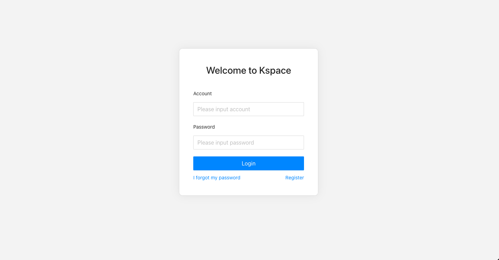
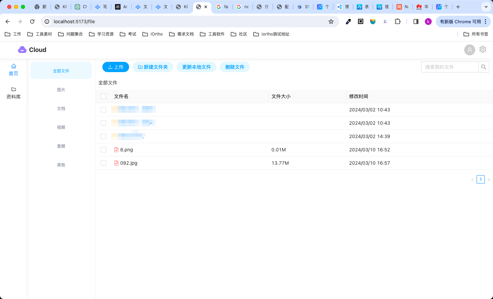
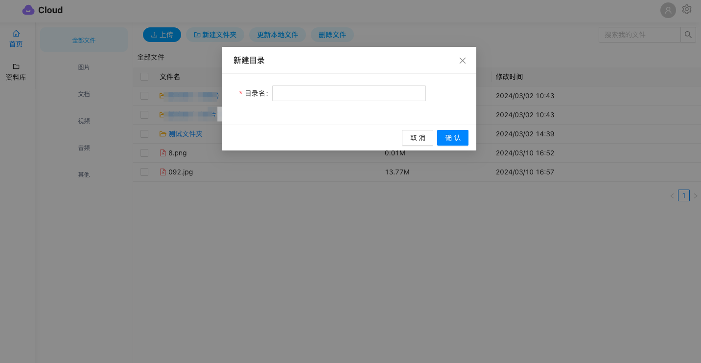

# xSpace

xSpace为了方便存储个人文件的云盘，目前支持本地存储。
- 前端：vue3+typescript+antd实现UI
- 后端：koajs+typescript+mongodb实现文件存储
- CI/CD：采用jenkins进行项目的构建和部署

# 功能列表

- 文件列表显示 :white_check_mark:
- 文件详情查看
- 文件下载/删除 :white_check_mark:
- 文件分享（生产分享链接）
- 文件新建文件夹 :white_check_mark:
- 文件上传（支持多文件）
- 用户登录 :white_check_mark:
- 用户增删改查
- 用户权限，支持管理员和游客

# 页面展示及Demo







# 项目配置及部署


- [后端项目地址](https://gitee.com/rootingcv/Kspace-server.git)

## 开发及部署
- 安装依赖
```sh
npm install
```
- 运行
```sh
npm run dev
```
- 编译

```sh
npm run build
```

sudo docker build -t Kspace-$BUILD_NUMBER .
sudo docker stop Kspace-frontend
sudo docker rm Kspace-frontend
sudo docker run -p 4001:80 -d --name Kspace-frontend Kspace-$BUILD_NUMBER